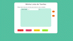

# ToDoList

  
<strong> Preview da Aplicação </strong>

  
Gif do App 

  

Este projeto é uma aplicação web que permite criar e gerenciar listas de tarefas. Ele oferece diversas funcionalidades, incluindo:

- **Criação de tarefas**: É possível adicionar novas tarefas à lista, definindo o que será a tarefa.

- **Exclusão de lista**: O usuário pode apagar todas as tarefas da lista de uma só vez.

- **Persistência de lista**: A lista de tarefas é salva no navegador ao clicar no botão de salvar lista, e pode ser recuperada quando a página é recarregada.

- **Seleção de tarefa**: O usuário pode selecionar uma tarefa da lista clicando nela.

- **Riscar tarefa selecionada**: Ao selecionar uma tarefa, o usuário pode marcá-la como concluída, riscando o seu nome.

- **Troca de posição de tarefa**: O usuário pode mover uma tarefa para uma nova posição na lista, clicando nos botões de " cima " e " baixo" para coloca-la no lugar desejado.

- **Exclusão de tarefa selecionada**: O usuário pode excluir uma tarefa da lista ao selecioná-la e clicar no botão de exclusão.

Este projeto foi desenvolvido utilizando as seguintes tecnologias: `HTML, CSS e JavaScript`. Além disso, a aplicação faz uso do recurso de armazenamento local do navegador (`LocalStorage`) para persistir os dados da lista de tarefas. A manipulação dos elementos da interface do usuário é feita através da `manipulação do DOM em JavaScript`.

### Para utilizar a aplicação, basta acessar o seguinte link: [App TodoList](https://brunobenunes.github.io/todolist/).
